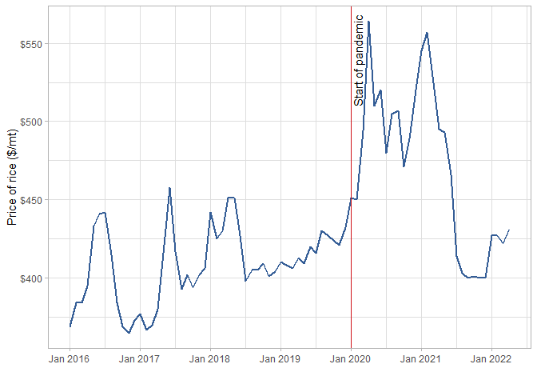
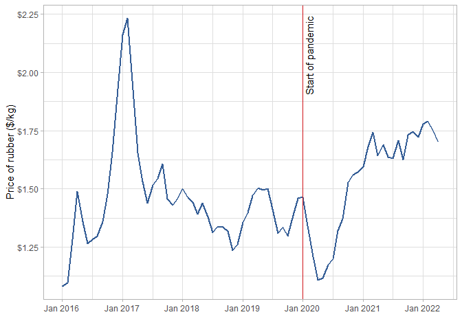
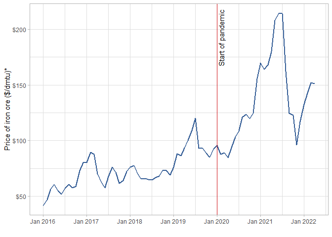
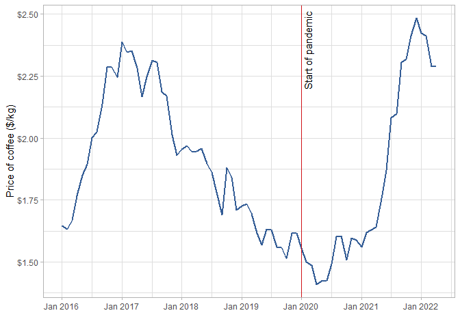
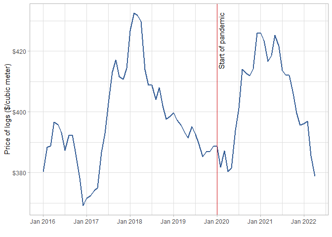
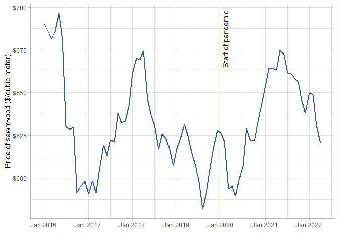

World commodity prices important to Liberia
================

Source: [World Bank Commodity Price
Data](https://www.worldbank.org/en/research/commodity-markets)

All prices are in nominal U.S. dollars.

## Rice

<!-- -->

## Palm Oil

<!-- -->

## Rubber

<!-- -->

## Iron ore

<!-- -->

## Oil

<!-- -->

## Gold

<!-- -->

## Cocoa

<!-- -->

## Coffee

<!-- -->

## Logs

<!-- -->

## Sawnwood

<!-- -->
